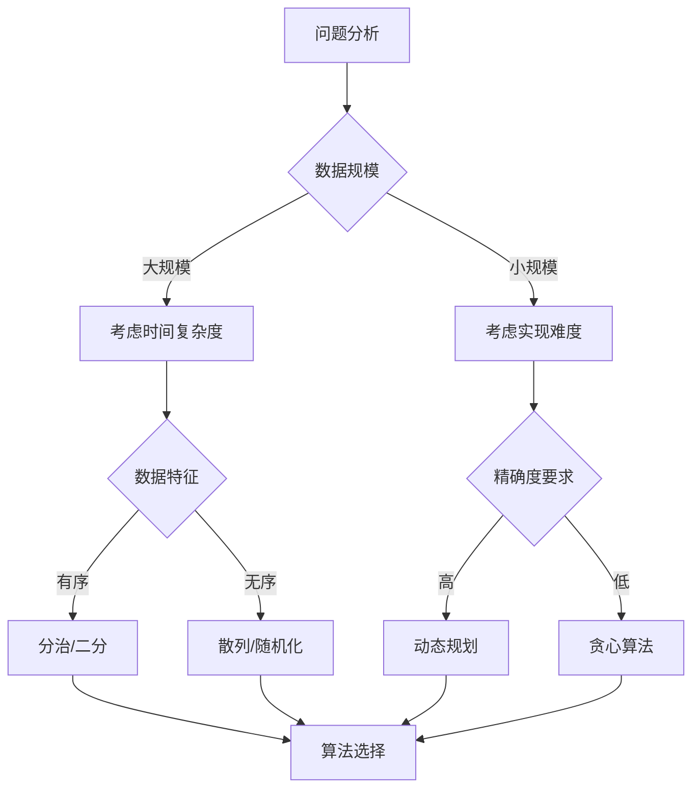

根据您分享的课程大纲，我来帮您制定算法选择策略。

1. 基础数据结构选择策略：
```
数据规模和操作需求 → 选择合适的数据结构

A. 查找操作频繁：
- 小规模、无序 → 链表
- 大规模、有序 → 二叉搜索树/AVL树
- 需要范围查询 → 二叉搜索树/AVL树

B. 插入/删除频繁：
- 要求有序 → AVL树
- 不要求有序 → 链表/散列表

C. 空间要求高：
- 稠密数据 → 数组
- 稀疏数据 → 链表/树
```

2. 算法选择决策流程：



3. 具体场景选择策略：

```
A. 搜索问题：
- 全局最优解 → 动态规划
- 局部最优解 → 贪心算法
- 图遍历 → 分治法

B. 优化问题：
- 有重叠子问题 → 动态规划
- 局部最优可行 → 贪心算法
- 问题可分 → 分治法

C. 排序问题：
- 小规模 → 插入排序
- 大规模稳定 → 归并排序
- 大规模不要求稳定 → 快速排序
```

4. 复杂度考虑：

时间复杂度优先级：
1. O(1) - 散列表查找
2. O(log n) - 二分查找/AVL树
3. O(n) - 线性扫描
4. O(n log n) - 归并排序
5. O(n²) - 简单排序算法

5. 选择流程示例：

```python
def choose_algorithm(problem):
    if problem.is_search_problem():
        if problem.needs_optimal_solution():
            if problem.has_overlapping_subproblems():
                return "动态规划"
            else:
                return "分治法"
        else:
            return "贪心算法"
            
    elif problem.is_sort_problem():
        if problem.size < 1000:
            return "插入排序"
        elif problem.needs_stable():
            return "归并排序"
        else:
            return "快速排序"
```

6. 实际应用建议：

A. 数据结构选择：
```
1. 查找优先：
   小数据量 → 数组/链表
   大数据量 → AVL树/散列表

2. 更新优先：
   频繁更新 → 链表/散列表
   少量更新 → 数组/树结构
```

B. 算法选择：
```
1. 排序算法：
   n < 50 → 插入排序
   n ≥ 50 → 快速排序/归并排序

2. 搜索算法：
   有序数据 → 二分查找
   无序数据 → 散列查找
```

7. 解题步骤建议：

1) 分析问题特征：
- 数据规模
- 时间/空间限制
- 特殊要求

2) 选择基本方向：
- 分治
- 动态规划
- 贪心
- 随机化

3) 具体算法选择：
- 考虑实现难度
- 考虑维护成本
- 考虑扩展性

8. 记忆要点：

1. 重点掌握：
- 动态规划
- 分治法
- 贪心算法
- 二叉树相关操作

2. 常见应用：
- 排序 → 归并/快速
- 查找 → 二分/散列
- 图论 → 最短路/生成树

这样的策略体系可以帮助您：
1. 快速定位合适的算法
2. 权衡不同方案的优劣
3. 做出合理的选择
4. 解释选择的理由