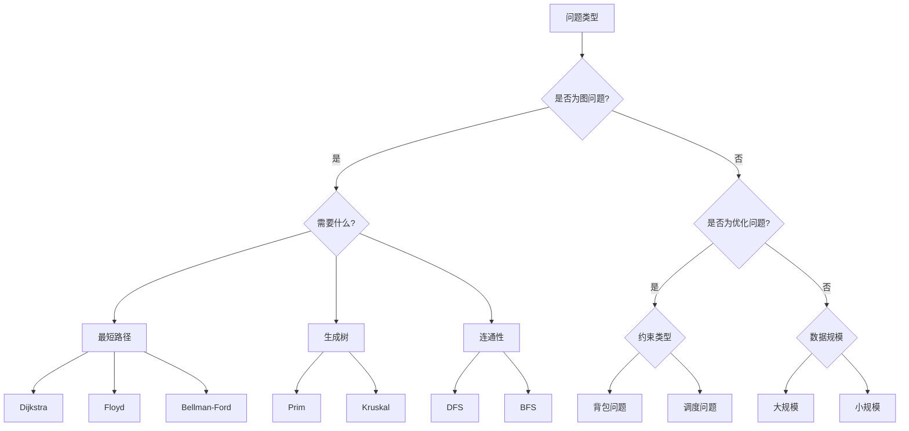

让我帮你建立一个系统的算法选择思维框架：

1. 问题分析步骤：

A. 核心特征识别
- 数据规模多大？
- 有无特殊约束？
- 需要什么操作？（查找、排序、优化等）
- 数据结构是什么？

B. 场景特征识别
```
1. 网络/图问题：
   - 寻路导航 → 最短路径算法(Dijkstra/A*)
   - 网络布线 → 最小生成树(Prim/Kruskal)
   - 网络流量 → 最大流算法
   - 任务调度 → 拓扑排序

2. 优化问题：
   - 资源分配 → 动态规划/贪心
   - 成本最小化 → 最小生成树
   - 效率最大化 → 贪心/动态规划

3. 查找/搜索：
   - 完整遍历 → DFS/BFS
   - 最优路径 → A*/Dijkstra
   - 特定模式 → KMP/正则表达式
```

2. 算法选择决策树：



3. 常见场景对应算法：

```
场景 → 算法建议

1. 物流配送
- 路径规划：Dijkstra/A*
- 仓库选址：重心算法
- 配送调度：贪心/动态规划

2. 社交网络
- 好友推荐：图的遍历(BFS/DFS)
- 关系分析：最短路径
- 群组发现：连通分量算法

3. 资源调度
- 任务分配：匈牙利算法
- 负载均衡：网络流
- 时间安排：图着色

4. 网络设计
- 布线优化：最小生成树
- 容量规划：最大流
- 可靠性：双连通分量

5. 游戏开发
- 寻路：A*算法
- 地图生成：最小生成树
- AI决策：极小极大算法
```

4. 选择考虑因素：

A) 时间要求
- 实时性要求高 → 贪心/快速算法
- 可以离线处理 → 精确算法

B) 空间限制
- 内存受限 → 空间优化算法
- 资源充足 → 时间优化算法

C) 准确性要求
- 需要最优解 → 精确算法
- 允许近似 → 启发式算法

5. 实际应用举例：

```python
# 例：选择路径规划算法
def choose_path_algorithm(scenario):
    if scenario.is_real_time:
        if scenario.has_heuristic:
            return "A*"
        else:
            return "Dijkstra"
    else:
        if scenario.needs_all_pairs:
            return "Floyd-Warshall"
        else:
            return "Bellman-Ford"

# 例：选择资源分配算法
def choose_resource_algorithm(problem):
    if problem.is_divisible:
        return "Greedy"
    else:
        if problem.size < 1000:
            return "Dynamic Programming"
        else:
            return "Approximation Algorithm"
```

6. 判断标准：

建立一个评分系统：
```python
def evaluate_algorithm(algorithm, requirements):
    score = 0
    
    # 时间复杂度评分
    if algorithm.time_complexity <= requirements.time_limit:
        score += 5
        
    # 空间复杂度评分
    if algorithm.space_complexity <= requirements.space_limit:
        score += 3
        
    # 准确性评分
    if algorithm.accuracy >= requirements.min_accuracy:
        score += 4
        
    # 实现复杂度评分
    if algorithm.implementation_difficulty <= requirements.max_difficulty:
        score += 2
        
    return score
```

记住：
1. 没有完美的算法，只有最适合的算法
2. 实际应用中要考虑多个因素
3. 可以组合多个算法解决复杂问题
4. 要考虑实现和维护成本

这个框架可以帮助你：
1. 快速定位可能的算法
2. 权衡不同算法的优劣
3. 做出合理的选择
4. 解释你的选择理由